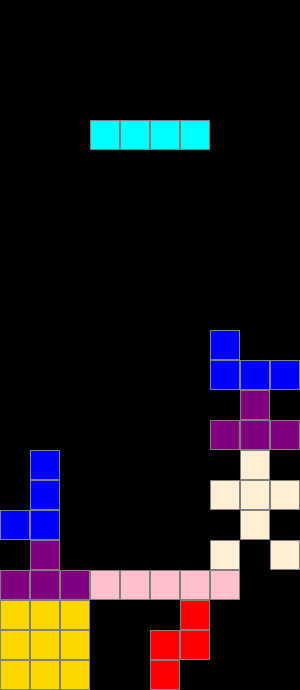

# Tetris

A version of Tetris written in Python with tkinter, with some extra pieces of my own.
I wrote it in my own time, with a friend giving me tips along the way.



## Features

- The 7 classic Tetris pieces, plus 5 custom ones: a **stickman**, a 5-long bar,
  a 3×3 block, a 2×3 block and a corner piece
- Pieces can be moved, rotated and dropped, and full rows are cleared
- Pause and restart at any time

## Controls

| Key | Action |
| --- | --- |
| ← / A | Move left |
| → / D | Move right |
| ↓ / S | Move down faster |
| ↑ / W | Rotate |
| Space / P | Pause |
| R | Restart |
| Esc | Quit |

## How to run it

You need Python 3 installed (tkinter comes with it).

```
python tetris.py
```

## How it works

- **The board** is a grid of 23 rows × 10 columns, stored as a list of lists.
  Each square is either empty (`None`) or holds the letter of the piece that landed there.
- **Pieces** are small grids of 1s and 0s. **Rotating** a piece reverses its rows and
  then swaps rows with columns (`zip(*shape[::-1])`), which turns it 90° clockwise.
- **Collision checking**: before any move or rotation, the game checks that every square
  of the piece would still be inside the board and not overlapping a landed square.
  If it would collide, the move is ignored.
- **Clearing lines**: the game keeps only the rows that still have a gap, then adds that
  many empty rows back at the top, so everything above a cleared row drops down.
- **The game loop** uses `root.after()` to move the piece down one square every 500 ms.

## Ideas for next steps

- Add a score and a level system that speeds up the game
- Show the next piece in a preview box
- Add a "hard drop" key that sends the piece straight to the bottom
